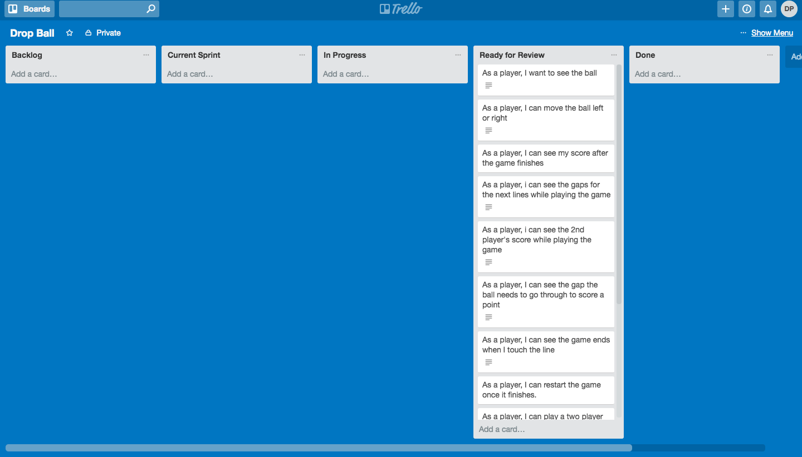

# Drop Ball
 Drop ball is a game in which the player has to move the ball left or right to pass it through the gap in order to score points. The game has 50 gaps to go through. The speed at which the ball moves down increases as the game proceeds. The game can be played as one player or two players.

## Task

 Your mission, should you choose to accept it! Is to build a **browser based game!** Your game should be built using html, css and JavaScript!

 **The choice of game is totally up to you however before you get to work, you must ensure you have had your project idea approved by one of your trainers.**

 Your game must:

 * Include an instruction section explaining how to play the game.
 * Ether display a message when the user has won or display the users score after the game has finished.
 * Be styled to perfection!
 * Be hosted online!

## User Stories

1. As a player, I want to see the ball.
2. As a player, I can move the ball left or right.
3. As a player, I can see my score after the game finishes.
4. As a player, i can see the gaps for the next lines while playing the game.
5. As a player, I can see the 2nd player's score while playing the game.
6. As a player, I can see the gap the ball needs to go through to score a point.
7. As a player, I can see the game ends when I touch the line.
8. As a player, I can restart the game once it finishes.
9. As a player, I can play a two player game.
10. As a player, I can press a button to start the game.
11. As a player, I can to see my score while I am playing the game.
12. As a  player, I can read instructions before I start the game.

## What I am most pleased with
The increase in speed along the game. This made the game more fun and challenging. I am also pleased with the look of the game as it has a simple design, yet it stands out due to the colours of each element.

## Most challenging part
Ending the game when the ball collides with the line. It was difficult to get the positions of the lines and the ball throughout the game as the lines are consistently moving and the ball can also move left and right. Hence, the position had to be updated continuously.

## Planning
I planned the project using a wireframe and Trello as shown below. The wireframe gave me an idea of how I would position elements in the game.

I first completed sprint 1 and kept a track of the current sprint. I moved each use story on Trello to show the current stage it was at.

